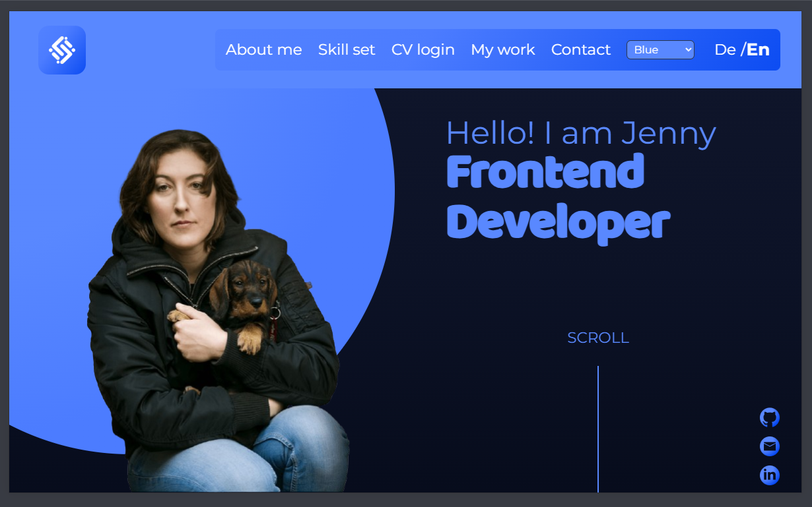
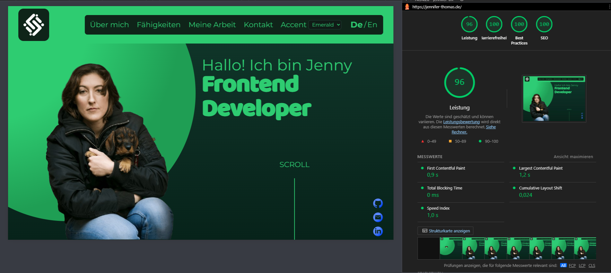

Personal portfolio website built with Angular 17 to showcase my work as a frontend developer, my technical stack, and selected projects. It’s designed to be fast, accessible, responsive, and easy to maintain. It includes a **protected CV area** (login, résumé and certificate views) backed by a small **Node/Express API** in development and optional **PHP endpoints** in the production build.

- Live site: https://www.jennifer-thomas.de
- Repository: https://github.com/TerrorDackel/2026-portfolio
- Email: contact@jennifer-thomas.de
- LinkedIn: https://www.linkedin.com/in/jennifer-thomas-595735360/

---

## Preview



---

## Features

- Single-page portfolio built with Angular 17 (standalone components)
- Clear section structure: hero, skill set, projects, references, contact
- **Protected CV section:** login, session-based access, overview with document links
- **Résumé & certificate:** dedicated routes with print-friendly styles where applicable
- **Admin area** (authenticated): operational helpers such as log inspection (when enabled)
- Responsive layout for mobile, tablet and desktop
- Sass architecture with reusable mixins and consistent breakpoints
- Smooth scrolling and subtle reveal animations
- Internationalization (DE/EN) with JSON translation files (client-side language toggle)
- External links to live demos and GitHub repositories of my projects
- Accessibility improvements (semantic HTML, readable font sizes, focus states where applicable)
- Form UX with inline validation feedback and success/error messaging
- Color switcher with automatic dark/light mode

---

## Tech stack

- **Framework:** Angular 17 (standalone components)
- **Languages:** TypeScript, HTML5, Sass (indented syntax), PHP (CV API endpoints for production deploy)
- **Frontend tooling:** Angular CLI, npm
- **CV API (development):** Node.js + Express (`server/index.cjs`), JWT, **bcrypt**, **cookie-parser**, **cors**
- **Other libraries (examples):** `pdf-lib` where used for document handling
- **Development proxy:** `proxy.conf.json` forwards `/api` to the local Express server (default **http://localhost:4000**)
- **Quality:** ESLint (Angular ESLint)
- **Version control:** Git & GitHub

---

## Quality signals (Lighthouse)



| Category | Score | Notes |
| --- | --- | --- |
| Performance | 96 | Desktop Lighthouse (local run, 2026-02-24) |
| Accessibility | 100 | Desktop Lighthouse (local run, 2026-02-24) |
| Best Practices | 100 | Desktop Lighthouse (local run, 2026-02-24) |
| SEO | 100 | Desktop Lighthouse (local run, 2026-02-24) |

---

## Key implementation details

- **Architecture:** Standalone components + routing, clean separation of layout (header/content/footer)
- **Styling:** Sass partials (`_core.sass`, `_responsive.sass`) + global utilities and mixins
- **i18n:** Translation files in `src/assets/i18n` (`de.json`, `en.json`) with a client-side language toggle
- **SEO & sharing:** Canonical URL + meta description, Open Graph and Twitter Card tags, JSON-LD Person schema, `robots.txt` + `sitemap.xml` (home + legal + privacy). English is the indexable default; German is a client-side UI toggle (no separate URLs).
- **UX:** Scroll helpers + lightweight animations (kept subtle to stay professional)
- **CV routing:** Routes under `cv-section` (e.g. login, home, résumé, certificate, admin) with `HttpClient` calling `/api/...` (proxied in dev)
- **Production build:** Angular copies `src/cv-section-api` (PHP) into the browser output (`angular.json` assets) for hosts that serve the SPA + API from the same origin

---

## Architecture & design decisions

- **Standalone components:** Simplifies module structure and keeps sections self-contained.
- **Translation pipeline:** Central JSON dictionaries keep text consistent and easy to update.
- **Responsive strategy:** Each section has dedicated `_responsive.sass` partials with shared mixins.
- **Progressive enhancement:** Features like reveal animations are subtle and optional.
- **CV API split:** Express for local development; PHP endpoints available in the static deploy bundle for typical shared hosting setups.

---

## Feature deep dive

- **Navigation & language switcher:** DE/EN toggle updates UI copy via `@ngx-translate`.
- **Contact form flow:** Inline validation, privacy consent requirement, success/error feedback.
- **Project cards:** External links and short descriptions for recruiter-friendly scanning.
- **CV flow:** Login → protected home with document entry points → résumé/certificate views; logout clears server session client-side expectations.

---

## Proof of work (project highlights)

- **Join:** Kanban-inspired task manager with drag-and-drop and assignment flows.
- **Pollo Loco:** Jump’n’Run with item collection and enemy interactions.
- **Pokédex:** PokéAPI-based catalog for viewing and filtering Pokémon data.

---

## Project structure (high level)

- `src/app` – root component, routing and application shell
- `src/app/header` – header, navigation and language switcher
- `src/app/content` – main sections (hero, skill set, projects, contact, etc.)
- `src/app/cv-section` – CV login, protected home, résumé/certificate pages, admin
- `src/app/footer` – footer with legal links
- `src/assets` – images, icons and translation files (`i18n`)
- `src/styles` – global styles, mixins and shared utilities
- `src/cv-section-api` – PHP API files copied into `dist/.../browser` on build (production-style deploy)
- `server/` – Express CV API for **local** development (`npm run start:cv-section-backend`)
- `proxy.conf.json` – dev proxy: `/api` → `http://localhost:4000`

---

## Configuration & security

- **Secrets:** Admin/credentials and hashes belong in **environment configuration** on the server or local `.env` (not committed). Never commit real passwords or production JWT secrets.
- **Repository:** Keep `.env` and similar files out of Git (see `.gitignore`).

---

## Deployment (overview)

- **Frontend:** `npm run build` produces static output under `dist/` (typical Angular layout).
- **API:** Depends on hosting: either serve the **PHP** endpoints from `dist/.../browser` (with appropriate server rewrites for SPA routes) or run a **Node** process if you mirror the dev API in production. Align `.htaccess` / server rules with your host’s documentation.

---

## Getting started

### Prerequisites

- Node.js (LTS)
- npm (comes with Node.js)

### Install & run (portfolio only)

```bash
npm install
npm start
```

Opens the dev server (with `proxy.conf.json` loaded). Open the URL shown in the terminal (e.g. **http://localhost:4200**).

### CV login & API (full stack locally)

You need **two** terminals from the project root:

1. **Terminal 1 – Angular**

   ```bash
   npm start
   ```

2. **Terminal 2 – CV API (Express)**

   ```bash
   npm run start:cv-section-backend
   ```

   Listens on **port 4000** by default; `npm start` proxies `/api` to that server.

### Other scripts

```bash
# Production build
npm run build

# Lint
npm run lint

# Unit tests
npm test
```

---

## Testing

**Unit tests**

- Component tests cover navigation behavior, language switching, and the contact form flow.
- Run with: `npm test`

**Manual smoke checks**

- Start with `npm start` (and `npm run start:cv-section-backend` if testing CV).
- Verify navigation anchor links scroll to the correct sections on the landing page.
- Switch language (DE/EN) and confirm the UI copy updates.
- Submit the contact form (with privacy consent) and confirm success/error feedback.
- **CV:** log in, open résumé/certificate routes, confirm logout; confirm API errors behave sensibly when the backend is stopped.
